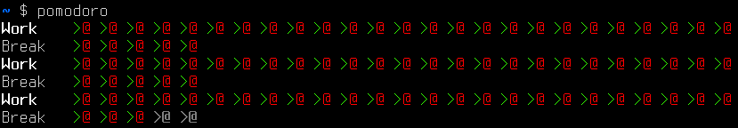

# pomodoro.c
*A small pomodoro timer written in C*

  A very simple pomodoro timer which requires no dependencies. Must be ran as root in order to get sound, as the internal PC speaker is used for the alarm.

  The Pomodoro Technique is a time management method created by Francesco Cirillo, ideal for studying or other work. See the [Wikipedia article](https://en.wikipedia.org/wiki/Pomodoro_Technique) for more information on the Pomodoro Technique.
## Requirements
  * gcc
  * Linux

## How to use
  Compile:

  `gcc pomodoro.c -o pomodoro`

  If you require sound:

  `sudo chown root:root ./pomodoro`

  `sudo chmod 4755. /pomodoro`

  If the `pcspkr` kernel module isn't already loaded:

  `sudo modprobe pcspkr`

  Run:

  `./pomodoro`

## Notes
  * This program does not accept parameters, to tweak, recompile. This is due to security concerns, as the program should be running as root in order to access the PC speaker.
